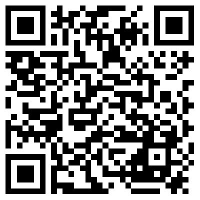

# 3dsalt
3DS Alternative Store 4 Universal-Updater

Database for Homebrew and unoffical translations of 3DS apps, selected and tested.

## Getting Universal Updater
1. Start the FBI on the 3DS 
2. Select "Remote Install > Scan QR Code"
3. Open this page in a browser and scan the QR code:
https://github.com/Universal-Team/Universal-Updater/releases

## Download 3DSAlt database with QR code
1. Start Universal Updater on the 3DS
2. In the Universal Updater go to the Settings (Cogwheel) > Unistore selection.
3. Choose the (last) QR icon, then scan the following QR code.

{width=50% height=50%}
